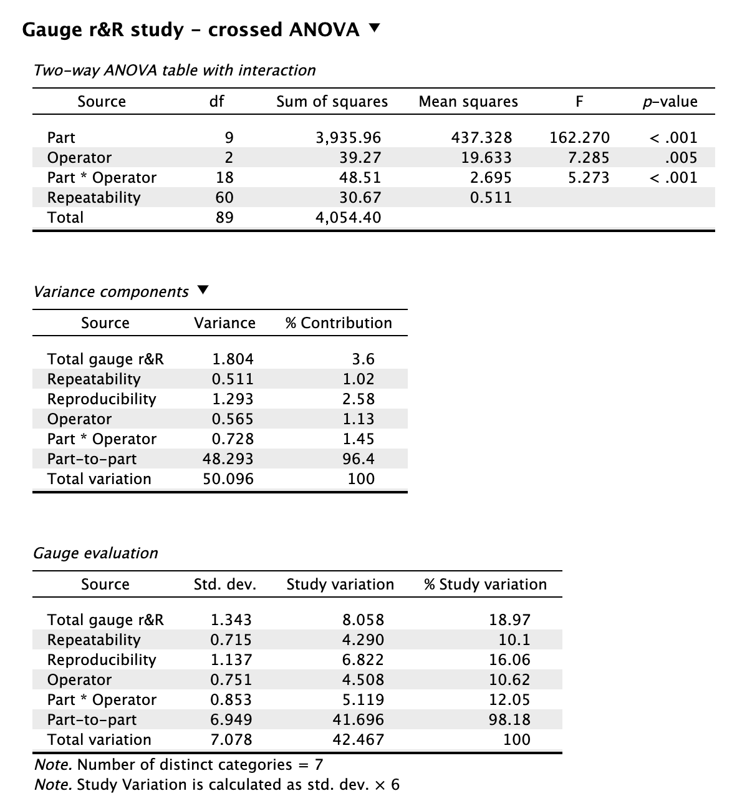
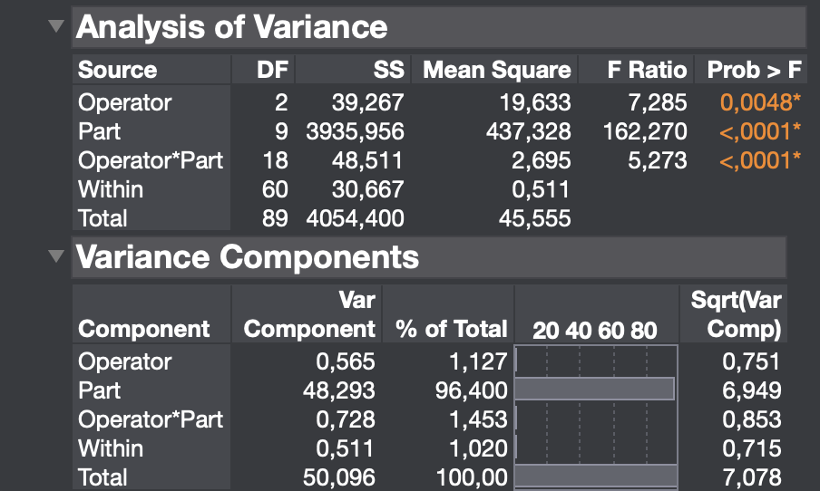
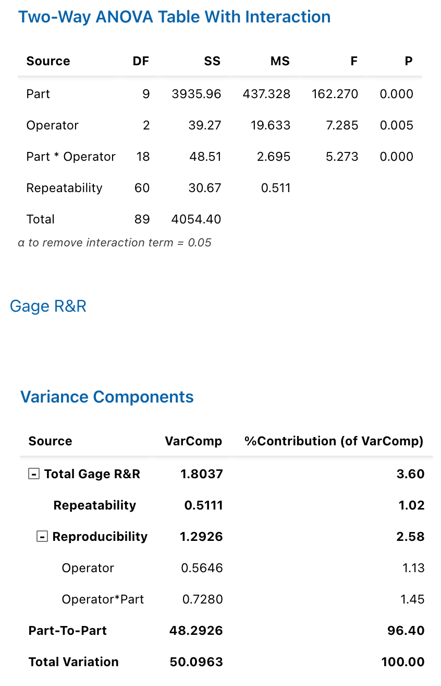
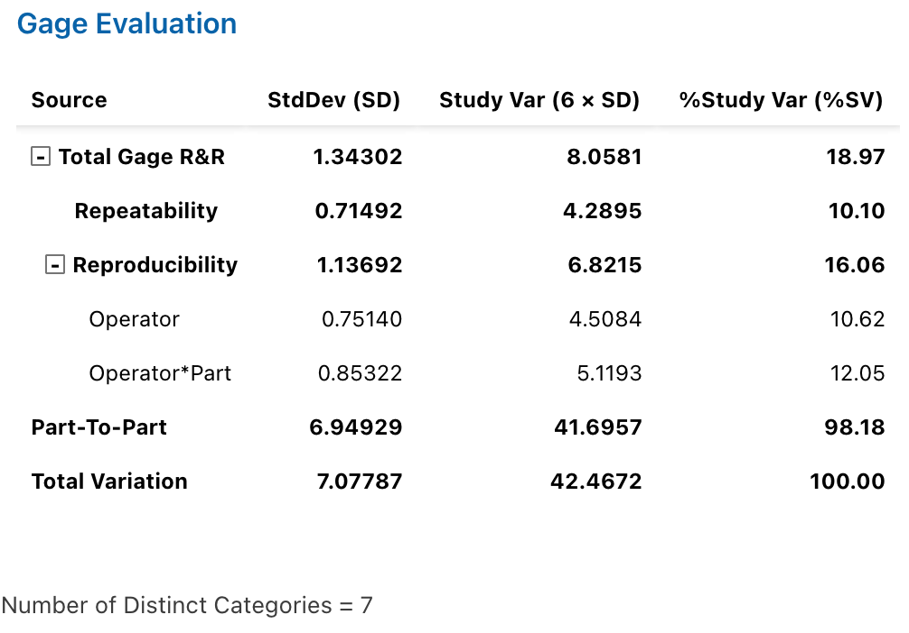
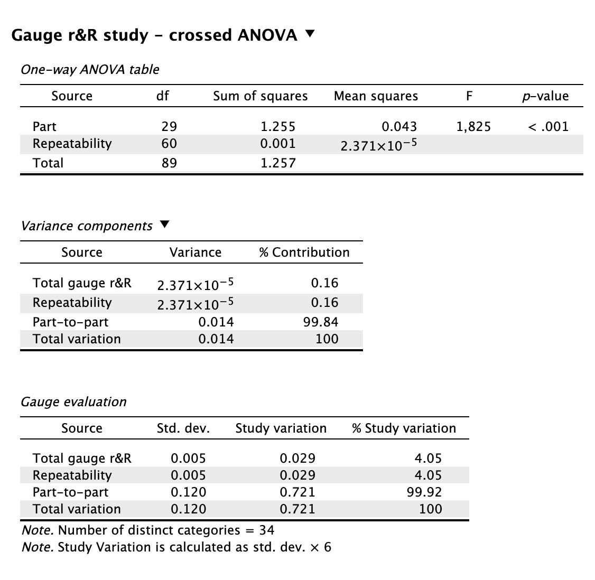
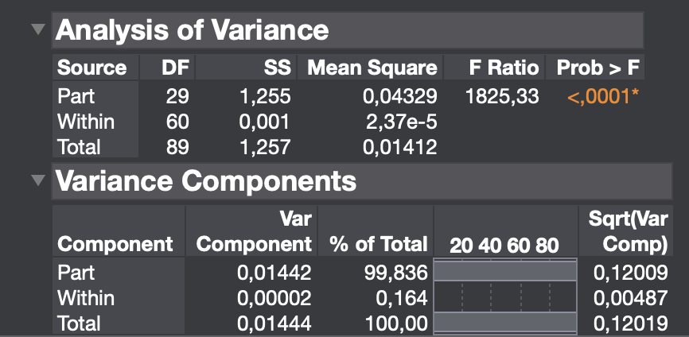
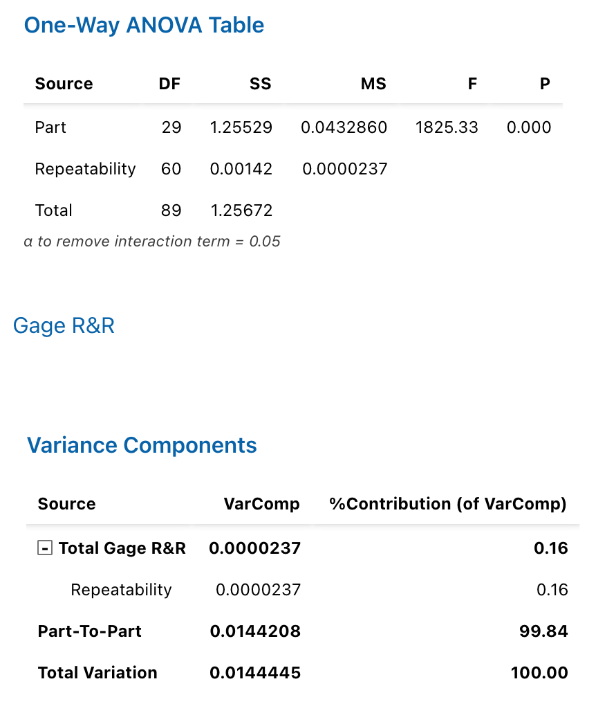
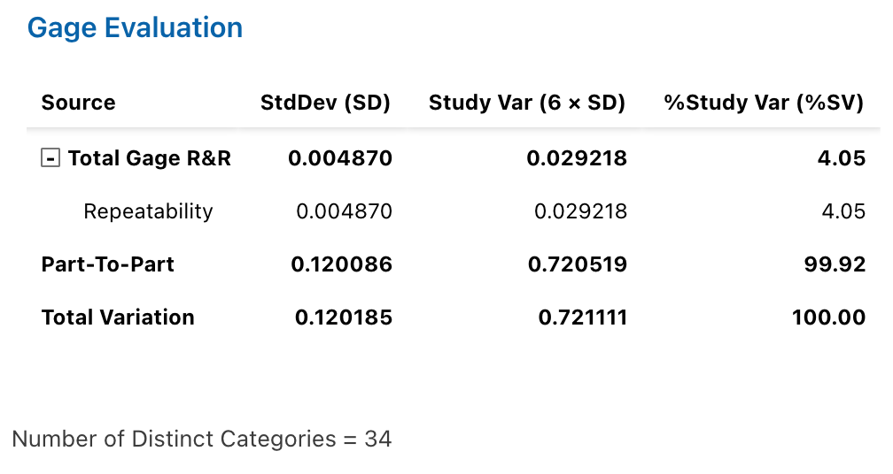

# Type 2 & 3 Gauge r&R Study

## Type 2 Gauge r&R Study {#GRR}

The example data are taken from Houf & Berman (1988) and concern the thermal impedance of $10$ different power modules (in $^\circ$C per $\text{Watt} \times 100$) as measured by $3$ different operators. Each operator measured each part $3$ times:

```{r, echo=FALSE}
dat <- read.csv("Datasets/GaugeRR.csv")
dat$Operator <- as.factor(dat$Operator)
dat$Part <- as.factor(dat$Part)
knitr::kable(dat, caption = "Example Data from Houf & Berman (1988)", booktabs = T)
```

### Results Overview {#ResultsGRR}

#### Variance Components
```{r, echo=FALSE}
resultsGRR <- matrix(c(1.804, 0.511, 1.293, 0.565, 0.728, 48.293, 50.096,
                       1.804, 0.511, 1.293, 0.565, 0.728, 48.293, 50.096,
                       1.804, 0.511, 1.293, 0.565, 0.728, 48.293, 50.096,
                       1.804, 0.511, 1.293, 0.565, 0.728, 48.293, 50.096,
                       1.804, 0.511, 1.293, 0.565, 0.728, 48.293, 50.096), 
                     nrow = 7, ncol = 5, byrow = FALSE)
colnames(resultsGRR) <- c("JASP", "By Hand", "JMP", "Minitab", "R")
rownames(resultsGRR) <- c("Total Gage R&R", "Repeatability", "Reproducibility", "Operator", "Part:Operator", "Part-To-Part", "Total Variation")
knitr::kable(resultsGRR, caption = "Results Overview Variance Components", booktabs = T)
```

#### % Contribution
```{r, echo=FALSE}
resultsGRR2 <- matrix(c(3.6, 1.02, 2.58, 1.13, 1.45, 96.4, 100,
                        3.6, 1.02, 2.58, 1.13, 1.45, 96.4, 100,
                        3.6, 1.02, 2.58, 1.13, 1.45, 96.4, 100,
                        3.6, 1.02, 2.58, 1.13, 1.45, 96.4, 100,
                        3.6, 1.02, 2.58, 1.13, 1.45, 96.4, 100),
                     nrow = 7, ncol = 5, byrow = FALSE)
colnames(resultsGRR2) <- colnames(resultsGRR)
rownames(resultsGRR2) <- rownames(resultsGRR)
knitr::kable(resultsGRR2, caption = "Results Overview % Contribution", booktabs = T)
```

### JASP {#jaspGRR}
```{r grrJASP, echo=FALSE, fig.cap="\\label{fig:grrJASP}JASP Output for Type 2 Gauge r&R Analysis"}

```

### By Hand {#byHandGRR}
```{r}
# number of levels
o <- nlevels(dat$Operator)
p <- nlevels(dat$Part)
n <- length(dat$Measurement) / (o * p)

# totals
grand_total <- sum(dat$Measurement)
C <- grand_total^2 / (o * p * n)

cell_totals <- with(dat, tapply(Measurement, list(Operator, Part), sum))
row_totals  <- rowSums(cell_totals)
col_totals  <- colSums(cell_totals)

# SS total
SS_total <- sum(dat$Measurement^2) - C

# SS O (Operator)
SS_O <- sum(row_totals^2) / (p * n) - C

# SS P (Part)
SS_P <- sum(col_totals^2) / (o * n) - C

# SS O×P
SS_OP <- sum(cell_totals^2) / n - SS_O - SS_P - C

# SS error
cell_sumsq <- with(dat, tapply(Measurement, list(Operator, Part), function(x) sum(x^2)))
SS_E <- sum(cell_sumsq - (cell_totals^2)/n)

# degrees of freedom
df_O <- o - 1
df_P <- p - 1
df_OP <- (o - 1) * (p - 1)
df_E <- o * p * (n - 1)

# mean squares
MS_O  <- SS_O / df_O
MS_P  <- SS_P / df_P
MS_OP <- SS_OP / df_OP
MS_E  <- SS_E / df_E

# Variance component estimates assuming that both Operators and Parts are random effects
sigma2_E  <- MS_E
sigma2_OP <- (MS_OP - MS_E) / n
sigma2_O  <- (MS_O - MS_OP) / (n * p)
sigma2_P  <- (MS_P - MS_OP) / (n * o)

reprod <- sigma2_O + sigma2_OP
repeatab <- sigma2_E
gauge <- reprod + repeatab
total <- gauge + sigma2_P

varComp <- c(gauge, repeatab, reprod, sigma2_O, sigma2_OP, sigma2_P, total)

# %Contribution
percContrib <- varComp / total * 100 

res <- matrix(c(varComp, percContrib), 
              nrow = 7, ncol = 2, byrow = FALSE)

colnames(res) <- c("Variance Components", "% Contribution")

rownames(res) <- c("Total Gage R&R", "Repeatability", "Reproducibility", "Operator", 
                   "Part:Operator", "Part-To-Part", "Total Variation")

res
```

### JMP {#jmpGRR}
```{r grrJMP, echo=FALSE, fig.cap="\\label{fig:grrJMP}JMP Output for Type 2 Gauge r&R Analysis"}

```

### Minitab {#minitabGRR}
```{r grrMinitab1, echo=FALSE, fig.cap="\\label{fig:grrMinitab1}Minitab Output for Type 2 Gauge r&R Analysis (Part 1)"}

```

```{r grrMinitab2, echo=FALSE, fig.cap="\\label{fig:grrMinitab2}Minitab Output for Type 2 Gauge r&R Analysis (Part 2)"}

```

### R {#rGRR}
```{r}
library(SixSigma)
ss.rr(Measurement, Part, Operator, data = dat, print_plot = FALSE)
```

## Type 3 Gauge r&R Study {#GRRType3}

Consider an example from Gadim & Doniavi (2018). The data concern the tensile strength of polymer yarns. Each of the $30$ yarns was measured $3$ times:

```{r, echo=FALSE}
datType3 <- read.csv("Datasets/GaugeRR2.csv")
datType3$Part <- as.factor(datType3$Part)
knitr::kable(datType3, caption = "Type 3 Gauge R&R Data from Gadim & Doniavi (2018)", 
             booktabs = TRUE)
```

### Results Overview {#ResultsGRRType3}

#### Variance Components
```{r, echo=FALSE}
resultsGRRType3 <- matrix(c(2.371 * 10^-5, 2.371 * 10^-5, 0.014, 0.014,
                            2.371 * 10^-5, 2.371 * 10^-5, 0.014, 0.014,
                            2 * 10^-5, 2 * 10^-5, 0.014, 0.014,
                            2.37 * 10^-5, 2.37 * 10^-5, 0.014, 0.014,
                            2.371 * 10^-5, 2.371 * 10^-5, 0.014, 0.014), 
                          nrow = 4, ncol = 5, byrow = FALSE)
colnames(resultsGRRType3) <- c("JASP", "By Hand", "JMP", "Minitab", "R")
rownames(resultsGRRType3) <- c("Total Gage R&R", "Repeatability", "Part-To-Part", "Total Variation")
knitr::kable(resultsGRRType3, caption = "Results Overview Variance Components", booktabs = T)
```

#### % Contribution
```{r, echo=FALSE}
resultsGRR2Type3 <- matrix(c(0.16, 0.16, 99.84, 100,
                             0.16, 0.16, 99.84, 100,
                             0.16, 0.16, 99.84, 100,
                             0.16, 0.16, 99.84, 100,
                             0.16, 0.16, 99.84, 100),
                     nrow = 4, ncol = 5, byrow = FALSE)
colnames(resultsGRR2Type3) <- colnames(resultsGRRType3)
rownames(resultsGRR2Type3) <- rownames(resultsGRRType3)
knitr::kable(resultsGRR2Type3, caption = "Results Overview % Contribution", booktabs = T)
```

### JASP {#jaspGRRType3}
```{r grrType3JASP, echo=FALSE, fig.cap="\\label{fig:grrType3JASP}JASP Output for Type 3 Gauge r&R Analysis"}

```

### By Hand {#byHandGRRType3}
```{r}
# number of levels
p <- nlevels(datType3$Part)
n <- length(datType3$Measurement)
r <-  n / p

# totals
grand_total <- sum(datType3$Measurement)

# SS total
SS_total <- sum((datType3$Measurement - mean(datType3$Measurement))^2)

# SS part
partMeans <- tapply(datType3$Measurement, datType3$Part, mean)
SS_P <- sum((partMeans - mean(datType3$Measurement))^2) * r

# SS error
deviations <- datType3$Measurement - rep(partMeans, each = r)
SS_E <- sum(deviations^2)

# degrees of freedom
df_P <- p - 1
df_E <- n - p

# mean squares
MS_P  <- SS_P / df_P
MS_E  <- SS_E / df_E

# Variance components
sigma2_E <- MS_E
sigma2_P <- (MS_P - MS_E) / r

repeatab <- sigma2_E
gauge <- repeatab
total <- gauge + sigma2_P

varComp <- c(gauge, repeatab, sigma2_P, total)

# %Contribution
percContrib <- varComp / total * 100 

res <- matrix(c(varComp, percContrib), 
              nrow = 4, ncol = 2, byrow = FALSE)

colnames(res) <- c("Variance Components", "% Contribution")

rownames(res) <- c("Total Gage R&R", "Repeatability", "Part-To-Part", "Total Variation")

res
```

### JMP {#jmpGRRType3}
```{r grrType3JMP, echo=FALSE, fig.cap="\\label{fig:grrType3JMP}JMP Output for Type 3 Gauge r&R Analysis"}

```

### Minitab {#minitabGRR}
```{r grrType3Minitab1, echo=FALSE, fig.cap="\\label{fig:grrType3Minitab1}Minitab Output for Type 3 Gauge r&R Analysis (Part 1)"}

```

```{r grrType3Minitab2, echo=FALSE, fig.cap="\\label{fig:grrType3Minitab2}Minitab Output for Type 3 Gauge r&R Analysis (Part 2)"}

```

### R {#rGRRType3}
```{r}
datType3$Operator <- rep(1, nrow(dat)) # as input for ss.rr() function
ss.rr(Measurement, Part, Operator, data = datType3, print_plot = FALSE)
```

### Remarks {#remarksGRR}
Variance components have been estimated using expected mean squares based on ANOVA in every software.

### References {#refGRR}
Gadim, H. G., & Doniavi, A. (2018). Improving structural properties of polymer fibers to design and construct fiber spinneret and optimize process parameters using response surface method and gage R&R. *Journal of Mechanical Science and Technology, 32*(3), 1135–1142. https://doi.org/10.1007/s12206-018-0216-7

Houf, R. E., & Berman, D. B. (1988). Statistical analysis of power module thermal test equipment performance. *IEEE Transactions on Components, Hybrids, and Manufacturing Technology, 11*(4), 516–520. https://doi.org/10.1109/33.16692


